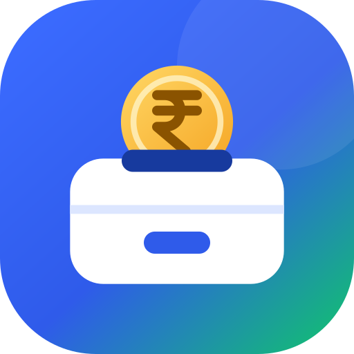

# Galla

**Spend · Split · Settle**

Galla is a personal expense tracker with Splitwise-style bill splitting, built for India (₹). It uses static HTML, a glass-style dashboard stylesheet and an optimized background asset, with no build step or server required.



## Features

**Personal money**
- Log expenses and income with categories, payment method (UPI, card, cash, net banking, auto-debit) and date
- Monthly overview: what's left, income, spending and daily spend (leaves out rent, investments and recurring payments)
- Category progress bars, day-by-day spending calendar, six-month income vs spending chart
- Insights: spending pace vs last month, biggest expense, next recurring payment
- Search and filter by text, type, category or day

**Budgets**
- Overall monthly budget with a progress meter and a "per day you can spend" figure
- Per-category limits with On track / Near limit / Over status

**Recurring entries**
- Rent, salary, SIPs, EMIs and subscriptions are logged automatically every month
- Pause, resume or delete; deleting one generated month doesn't bring it back

**Split with friends**
- Groups (trips, flatmates, office lunch) and individual friends
- Split equally, by exact amounts or by percentages; anyone can be the payer
- Only your share counts toward your personal spending
- Per-friend balances, "who owes whom" per group, one-tap settle-up
- Save a friend's UPI ID and copy a ready-to-send WhatsApp reminder

**Privacy and extras**
- Optional 4-digit PIN lock with auto-lock after time in the background (the PIN is stored as a salted SHA-256 hash)
- CSV export of every entry
- Sample data to try it out, removable in one tap
- Works on phone, tablet and desktop

## Run it

Open `index.html` in a browser. That's it.

To host it, enable **GitHub Pages** for this repo (Settings → Pages → deploy from the `main` branch, root folder). The app will be live at `https://<your-username>.github.io/galla/`.

## Where data is stored

| Where Galla runs | Storage |
|---|---|
| Opened directly or on GitHub Pages | The browser's `localStorage` on that device. Clearing site data erases it, and it doesn't sync between devices. Use CSV export for backups. |
| As a Claude artifact (claude.ai) | The signed-in user's private artifact storage, synced across devices. |

The app detects which one is available and picks automatically.

## Tests

End-to-end tests run the app in headless Chromium with a mocked account store:

```bash
pip install playwright
python -m playwright install chromium
python tests/run.py
```

The suite has 100 checks: adding, editing and deleting entries, income and balance maths, recurring back-fill and de-duplication, budgets, equal/exact/percent splits, settle-ups, balance consistency between friends and groups, group deletion, PIN lock (set, wrong PIN, lockout, change, turn off, forgot PIN), sample data, filters, CSV export, the browser-only fallback, and no sideways scrolling at phone and desktop widths in light and dark system themes. Screenshots are saved to `tests/screenshots/`.

## Project layout

```
index.html           the whole app (HTML, CSS, JS)
assets/galla-logo.svg
tests/run.py         Playwright end-to-end suite
tests/mock.js        in-memory stand-in for the Claude artifact storage
```

